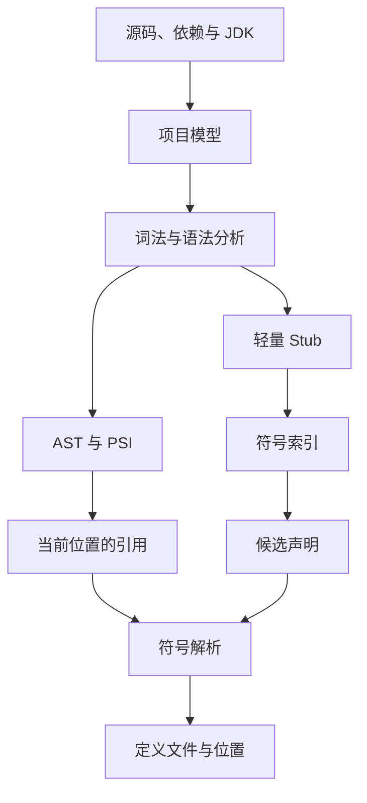
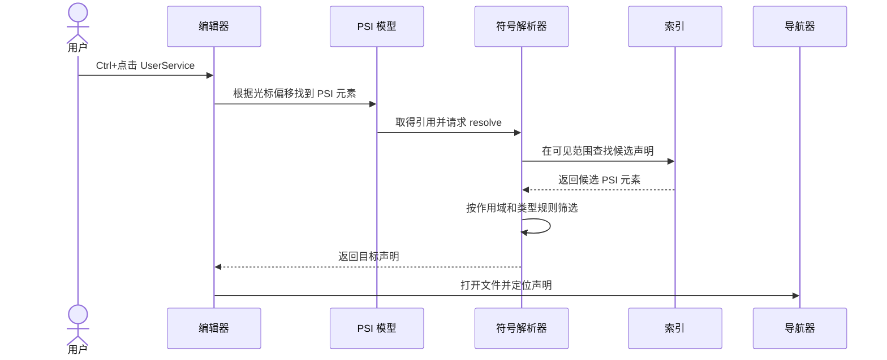
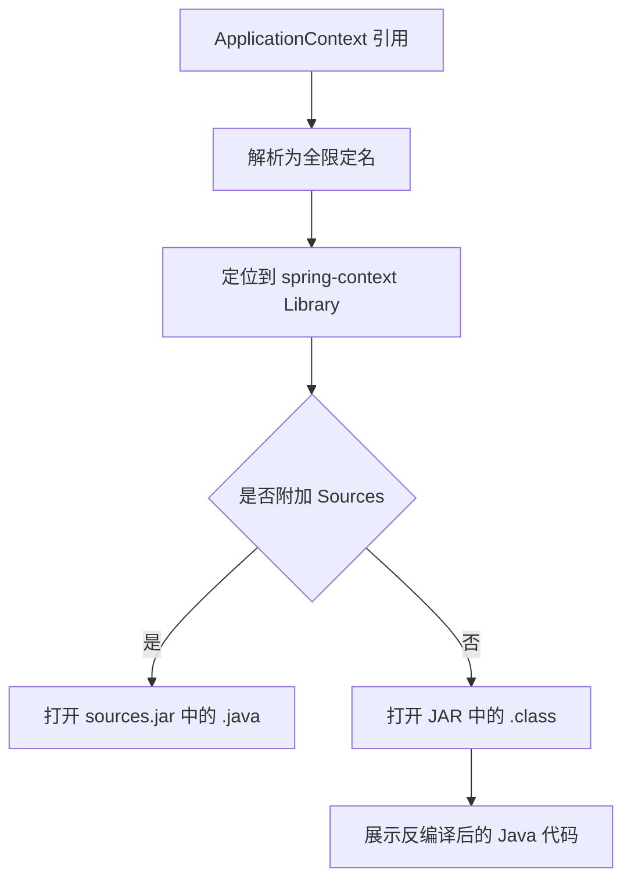
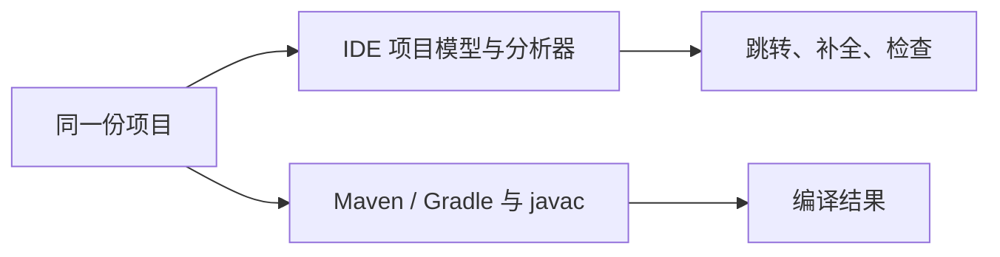

# Ctrl+点击背后发生了什么：IDE 跳转到定义的工作原理

在 IntelliJ IDEA 中，把鼠标放在一个类名上，按住 `Ctrl`（macOS 为 `Command`）再点击，IDE 几乎立刻就能打开它的定义。这个类可能在当前文件、另一个模块、Maven 依赖的 JAR，甚至 JDK 里。

例如：

```java
import com.example.user.UserService;

public class UserController {
    private final UserService userService;
}
```

点击 `UserService` 后，IDEA 能准确跳到：

```java
package com.example.user;

public interface UserService {
}
```

直觉上，这似乎只是“搜索 `UserService`”。但只要项目中再出现一个同名类，文本搜索就不够用了：

```java
com.example.user.UserService
com.example.admin.UserService
```

IDE 必须理解当前位置的 `UserService` 究竟引用了哪个声明。它真正做的是：

> 先把代码组织成可查询的结构和索引，再结合当前作用域、类型和项目依赖完成符号解析，最后打开解析结果对应的位置。

这套能力也是代码补全、查找引用、安全重命名和错误检查的共同基础。

## 先看完整链路

一次跳转同时依赖“提前准备的数据”和“点击发生时的语义计算”。



可以把它分成六个问题：

1. **哪些文件属于这个项目？**——由项目模型回答。
2. **这段文本是什么代码结构？**——由词法分析、语法分析和 PSI 回答。
3. **可能的声明在哪里？**——由索引快速缩小范围。
4. **当前位置真正指向哪一个声明？**——由符号解析器判断。
5. **目标在源码、依赖还是 JDK 中？**——由模块、Library 和 SDK 的搜索范围决定。
6. **最终展示什么？**——优先打开附加源码，没有源码时再展示反编译结果。

这里有一个容易被忽略的细节：IDEA 并不会始终把整个项目所有文件的完整 AST 都放在内存里。完整结构通常按需创建；索引阶段则会尽量使用文件内容、轻量语法树或只保留外部声明的 Stub。这样才能同时兼顾语义能力、启动速度和内存占用。JetBrains 的 [PSI Files 文档](https://plugins.jetbrains.com/docs/intellij/psi-files.html)也说明了 PSI 文件会在被访问时按需创建。

## 第一步：项目模型划定“可见世界”

在理解代码前，IDE 首先要知道项目由什么组成。对于一个 Java 项目，这通常包括：

- 当前模块的源码和测试源码
- 依赖的其他模块
- Maven 或 Gradle 导入的第三方库
- 当前模块使用的 JDK
- 生成代码目录、资源目录和被排除的目录

这些信息构成 IDE 的**项目模型**。JetBrains 将项目组织为 Project、Module、Content Root、Source Root，并用 Library 和 SDK 描述外部库与开发工具包。官方的 [Project Model 文档](https://plugins.jetbrains.com/docs/intellij/project-model.html)给出了这些概念之间的关系。

假设项目结构如下：

```text
shop
├── shop-web
│   └── src/main/java
├── shop-service
│   └── src/main/java
└── pom.xml

External Libraries
├── spring-context-6.x.jar
└── JDK 21
```

当 Maven 项目同步成功后，IDEA 会把 Maven 的模块和依赖关系转换成自己的项目模型。此后解析 `UserService` 时，搜索范围就不只是当前目录，而是当前模块可见的源码、模块依赖、第三方 Library 和 JDK SDK。

这解释了一个常见现象：依赖已经写进 `pom.xml`，但项目还没有同步时，类名依然标红，也无法跳转。磁盘上有没有 JAR 只是一部分条件；IDE 的项目模型是否把它纳入当前模块的可见范围同样关键。

## 第二步：从字符到 AST，再到 PSI

源码最初只是一串字符：

```java
userService.getUser(id);
```

IDE 要先经过词法分析，把字符分成标识符、点号、括号等 Token；再经过语法分析，把 Token 组织成抽象语法树（AST）。概念上可以表示为：

```text
MethodCallExpression
├── receiver: userService
├── methodName: getUser
└── arguments
    └── reference: id
```

AST 告诉 IDE 代码“长什么样”，但 IDE 还需要一种更适合查询、分析和修改代码的模型。在 IntelliJ 平台中，这一层叫 **PSI（Program Structure Interface）**。

一个 Java 文件在 PSI 中大致会呈现为：

```text
PsiJavaFile
├── PsiPackageStatement
├── PsiImportList
└── PsiClass: UserController
    ├── PsiField: userService
    └── PsiMethod: getUser
        ├── PsiParameter: id
        └── PsiCodeBlock
```

PSI 不只是给节点换了一组类名。它提供了语言层面的查询和修改接口，让 IDE 能够回答“这是一个类声明还是变量引用”“它的名称是什么”“这个引用指向谁”等问题。JetBrains 将 PSI 定义为 IntelliJ 平台中负责解析文件、建立语法与语义代码模型的一层；完整说明见 [Program Structure Interface](https://plugins.jetbrains.com/docs/intellij/psi.html) 和 [Implementing Parser and PSI](https://plugins.jetbrains.com/docs/intellij/implementing-parser-and-psi.html)。

因此，IDE 看到的 `UserService` 不是八个普通字符，而是某个 PSI 节点中的**类型引用**。这一步把“找字符串”变成了“解析代码”。

## 第三步：索引负责快速找到候选项

如果每次点击都打开所有文件、构建完整语法树再逐个查找，大型项目会慢得无法使用。因此 IDE 会提前建立索引。

索引可以粗略理解成下面这些映射：

```text
短类名 UserService
├── com.example.user.UserService
└── com.example.admin.UserService

全限定名 com.example.user.UserService
└── shop-service/src/main/java/.../UserService.java

方法名 getUser
├── UserService#getUser
└── UserRepository#getUser
```

IntelliJ 平台主要提供文件索引和 Stub 索引。Stub 是 PSI 树的一个紧凑子集，通常只保存能被其他文件看到的声明，例如类、方法和字段的名称及修饰符，而不保存方法体中的每一条语句。它可以序列化到磁盘，需要时再恢复成相应的 PSI 元素。相关机制可参考 JetBrains 的 [Indexing and PSI Stubs](https://plugins.jetbrains.com/docs/intellij/indexing-and-psi-stubs.html) 与 [Stub Indexes](https://plugins.jetbrains.com/docs/intellij/stub-indexes.html)。

索引很像数据库索引，但这个类比只能用到一半：

| 能力 | 数据库类比 | IDE 中的实际作用 |
|---|---|---|
| 按名称找类 | 按索引键查行 | 找到名称匹配的候选声明 |
| 限定搜索范围 | 添加查询条件 | 只查当前模块可见的源码、库和 SDK |
| 返回结果 | 返回记录 | 返回文件或 PSI 元素候选项 |
| 判断引用目标 | 通常不是索引职责 | 还要结合语言规则做符号解析 |

也就是说，索引回答的是“可能在哪里”，并不总能单独回答“当前位置指的是谁”。

## 第四步：符号解析选出真正的定义

考虑两个文件：

```java
// File A
import com.example.user.User;

User user;
```

```java
// File B
import com.example.admin.User;

User user;
```

两处都写了 `User`，索引也都能找到两个同名候选。符号解析器需要结合每个引用所在的上下文，分别解析为：

```text
File A: User → com.example.user.User
File B: User → com.example.admin.User
```

对于 Java，解析过程可能需要考虑：

- 当前代码块、方法和类中的声明
- `package`、显式 `import` 和静态导入
- 继承关系与成员可见性
- 表达式接收者的静态类型
- 方法重载、参数类型和可变参数
- 泛型类型替换与类型推断
- 当前模块的依赖和 JDK 类路径

例如：

```java
service.find(1L);
```

项目中可能同时存在：

```java
User find(Long id);
User find(String username);
```

只查方法名会得到两个候选。解析器还要知道 `service` 的类型以及实参 `1L` 的类型，才能选择 `find(Long)`。

在 IntelliJ 平台的抽象中，能作为引用的 PSI 元素会提供 `PsiReference`，其中最关键的方法是 `resolve()`：成功时返回目标声明对应的 PSI 元素，无法解析时返回 `null`。JetBrains 的 [References and Resolve](https://plugins.jetbrains.com/docs/intellij/references-and-resolve.html)明确说明，这一机制直接支撑跳转到声明，也是查找引用、重命名和代码补全的前提。

## 点击发生时，IDE 做了什么

准备好项目模型、PSI 和索引后，一次 `Ctrl+点击` 的过程可以简化为下面的时序：



这里的“快速”来自两部分：索引避免全项目扫描，PSI 和解析结果还可以按需缓存。文件修改后，相关结构和缓存会失效并重新计算，而不是每敲一个字符就从零分析整个项目。

## 为什么能跳进 Maven 依赖和 JDK

再看一个来自 Spring 的类型：

```java
import org.springframework.context.ApplicationContext;

private ApplicationContext applicationContext;
```

`ApplicationContext` 不在项目的 `src/main/java` 中，但 Maven 同步后，`spring-context` 已经作为 Library 加入模块依赖。Java Library 可以包含编译后的类、源码和文档，具体分类可参考 IntelliJ IDEA 的 [Libraries 文档](https://www.jetbrains.com/help/idea/library.html)。



第三方依赖通常有两种展示结果：

1. **存在源码包**：IDE 打开 `spring-context-版本-sources.jar` 中的 `.java` 文件。
2. **只有二进制 JAR**：IDE 定位到 `.class`，再用内置反编译器生成便于阅读的 Java 视图。

反编译得到的是根据字节码还原的代码，不等于作者原始源码。注释、局部变量名和部分语法细节可能已经丢失或发生变化。IntelliJ IDEA 使用内置的 Fernflower 展示这类内容，见官方的 [Bytecode decompiler 文档](https://www.jetbrains.com/help/idea/decompiler.html)。Maven 工具窗口也提供下载依赖源码的入口，参见 [Maven tool window](https://www.jetbrains.com/help/idea/maven-projects-tool-window.html)。

JDK 的处理方式相同。JDK 作为项目 SDK 加入可见范围；点击 `java.util.ArrayList` 时，IDE 会定位到 JDK 类。如果 SDK 附带或已关联源码，就打开源码；否则也可以显示编译类的反编译结果。

## 跳转、查找引用和重构为什么是一家人

假设有一个方法：

```java
public User getUser(Long id) {
    // ...
}
```

其他文件中出现：

```java
userService.getUser(1L);
```

当这个调用被解析到 `UserService#getUser(Long)` 后，IDE 就建立了“引用 → 声明”的语义关系。围绕这条关系，可以自然得到多种功能：

| IDE 功能 | 使用同一语义模型做什么 |
|---|---|
| 跳转到定义 | 从引用找到声明 |
| 查找引用 | 从声明反查所有解析到它的引用 |
| 重命名 | 修改声明及所有可确认的引用 |
| 代码补全 | 根据当前位置、类型和可见范围推荐候选 |
| 错误检查 | 发现无法解析、类型不匹配或不可访问的引用 |

这也说明了 `Find Usages` 与全文搜索的根本区别。全文搜索会命中注释、字符串以及无关的同名方法；查找引用关心的是哪些代码节点解析到了同一个符号。

不过，“安全重构”也有边界。下面这些动态用法未必能被静态分析完整识别：

```java
Class.forName("com.example.UserService");
methodName = "getUser";
```

反射、配置文件、模板、脚本和运行时生成代码都可能让符号关系藏在普通字符串里。成熟 IDE 会通过框架插件和特殊引用贡献器识别其中一部分，但无法对任意动态行为做绝对保证。

## 为什么索引期间很多功能会失效

IntelliJ 平台把索引尚未就绪的阶段称为 **Dumb Mode**。这个阶段仍可进行基本文本编辑和版本控制操作，但依赖索引的功能会受到限制；索引可用后进入 Smart Mode。这个行为在 [Indexing and PSI Stubs](https://plugins.jetbrains.com/docs/intellij/indexing-and-psi-stubs.html#dumb-mode) 中有直接说明。

因此，下面这些现象经常一起出现：

```text
无法跳转到定义
代码补全缺失
Find Usages 不完整
import 标红
检查与重构暂时不可用
```

它们并不是五个彼此无关的故障，而是共同依赖的索引或语义模型还没有准备好。

## 为什么 Maven 能编译，IDE 却一片红

IDEA 的代码分析模型与 Maven 调用的编译流程是两个系统。它们读取同一份项目，但拥有各自的项目配置、缓存、JDK 设置和生命周期。



所以完全可能出现：

- Maven 已按 `pom.xml` 找到依赖并成功编译，但 IDEA 尚未同步依赖。
- IDEA 使用 JDK 21 分析代码，而 Maven 实际使用 JDK 17。
- Maven 在构建阶段生成了源码，但 IDE 没把生成目录标记为 Source Root。
- 某个目录被 IDE 排除，构建工具却仍然会编译它。
- 文件超过 IDE 的代码分析限制，出现 `Code insight features are not available`，但编译器仍能处理它。

反过来也可能发生：编辑器暂时没有标红，但命令行构建因激活的 Profile、环境变量或插件配置不同而失败。因此，IDE 的绿色提示不能替代真实构建，命令行构建成功也不保证 IDE 项目模型一定健康。

## 跳转失效时怎么排查

遇到无法跳转时，可以按下面的顺序检查：

| 现象 | 常见原因 | 优先检查 |
|---|---|---|
| 整个项目都无法跳转 | 正在索引或索引任务卡住 | 等待索引完成，查看后台任务 |
| 只有第三方类标红 | 依赖没有导入当前模块 | Maven/Gradle 同步、模块 Dependencies |
| JDK 类无法解析 | SDK 未配置或版本不一致 | Project SDK、Module SDK、构建工具 JDK |
| 只有某个目录失效 | Source Root 标记错误或目录被排除 | Project Structure 中的目录类型 |
| 生成类找不到 | 生成源码尚未产生或未标记 | 运行生成步骤并刷新项目模型 |
| 只有一个超大文件失效 | IDE 关闭了该文件的 Code Insight | 文件大小限制和顶部提示 |
| 能看反编译代码但没有原始源码 | 没有关联 sources JAR | 下载或手动关联依赖源码 |
| 修改依赖后结果仍旧陈旧 | 项目模型或相关缓存没有更新 | 先重新同步并重开文件，再考虑修复缓存 |

`Invalidate Caches` 不适合作为第一步。多数问题来自项目没有同步、SDK 不一致或目录标记错误；先修正这些输入，通常比直接清空所有缓存更快，也更容易找到真正原因。

## VS Code 等编辑器也是同一个思路吗

整体思路相似，部署位置可能不同。

IntelliJ IDEA 将大量语言能力集成在 IDE 平台和语言插件中。VS Code 常通过 Language Server Protocol（LSP）把“跳转到定义”请求发送给 Java、TypeScript、Go 等语言服务器。编辑器负责光标和界面，语言服务器负责维护项目、解析代码、建立索引并返回定义位置。

```text
编辑器 -- textDocument/definition --> 语言服务器
编辑器 <-- 文件 URI + 行列位置 ----- 语言服务器
```

对用户来说都是一次点击；对底层来说，核心仍然绕不开项目边界、语法树、符号表、索引、类型系统和引用解析。

## 最后记住这五点

1. **跳转到定义不是全文搜索**，它先识别引用，再解析到声明。
2. **项目模型决定搜索边界**，源码、模块依赖、Library 和 JDK 都在其中。
3. **PSI 表示代码结构与语义**，索引负责快速提供候选，两者职责不同。
4. **符号解析才做最终选择**，它需要作用域、导入、类型、重载和依赖关系。
5. **补全、查找引用和重构共享同一套基础设施**，所以索引或项目模型出问题时，它们往往一起失效。

从这个角度看，IDEA 并不只是一个带语法高亮的文本编辑器。它更像一个持续运行、增量更新，并且能直接操作代码结构的静态分析系统。`Ctrl+点击` 只是这套系统最直观的一次查询。

## 参考资料

- [IntelliJ Platform Plugin SDK：Program Structure Interface](https://plugins.jetbrains.com/docs/intellij/psi.html)
- [IntelliJ Platform Plugin SDK：Implementing Parser and PSI](https://plugins.jetbrains.com/docs/intellij/implementing-parser-and-psi.html)
- [IntelliJ Platform Plugin SDK：Indexing and PSI Stubs](https://plugins.jetbrains.com/docs/intellij/indexing-and-psi-stubs.html)
- [IntelliJ Platform Plugin SDK：References and Resolve](https://plugins.jetbrains.com/docs/intellij/references-and-resolve.html)
- [IntelliJ Platform Plugin SDK：Project Model](https://plugins.jetbrains.com/docs/intellij/project-model.html)
- [IntelliJ IDEA Documentation：Source code navigation](https://www.jetbrains.com/help/idea/navigating-through-the-source-code.html)
- [IntelliJ IDEA Documentation：Libraries](https://www.jetbrains.com/help/idea/library.html)
- [IntelliJ IDEA Documentation：Bytecode decompiler](https://www.jetbrains.com/help/idea/decompiler.html)
