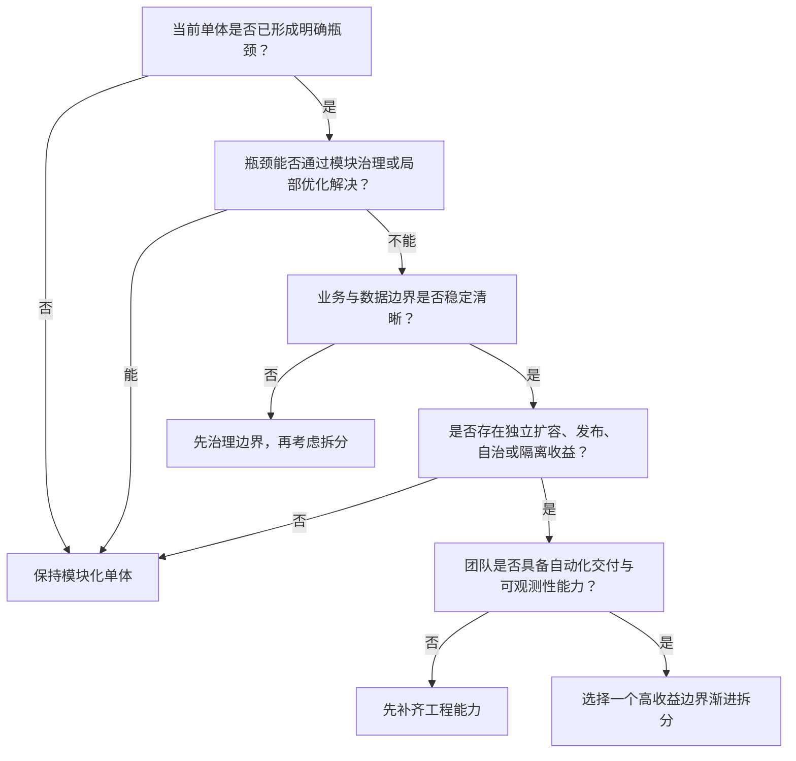

# 微服务的收益、代价与拆分判断

谈到系统架构，微服务经常被描述成单体应用的“下一阶段”：项目做大了，就应该拆服务；服务越多，架构似乎越成熟。

但微服务并不是高级版单体，也不是项目规模增长后的必然终点。它真正做的是一笔交换：**用分布式系统的复杂度，换取独立部署、独立扩容、团队自治和一定程度的故障隔离。**

这笔交换是否划算，取决于业务、团队和基础设施是否真的需要这些能力。服务拆分只是开始，拆分之后长期存在的一致性、调用、监控和运维成本，才是微服务真正昂贵的地方。

本文尝试回答三个问题：

1. 微服务究竟解决什么问题？
2. 拆分之后需要承担哪些代价？
3. 如何判断一个系统现在是否应该拆？

## 微服务究竟解决什么问题

单体应用不等于设计混乱。一个结构良好的单体同样可以划分模块、隔离依赖，并拥有清晰的业务边界。它与微服务最关键的区别，是这些模块通常仍在同一个进程中，一起构建、部署和扩容。

随着业务和团队增长，这种统一可能逐渐成为约束：

- 修改一个小功能，也要重新测试并发布整个应用；
- 不同业务的流量差异很大，却只能整体扩容；
- 多个团队频繁修改同一个代码库，发布节奏互相影响；
- 某个模块耗尽线程、内存等资源，可能拖垮整个进程；
- 系统持续膨胀后，理解、测试和交付的成本越来越高。

微服务通过进程和部署层面的隔离，让服务可以独立开发、发布和扩容。因此，它的主要收益可以归纳为四类：

| 收益 | 适用场景 | 需要先满足的条件 |
| --- | --- | --- |
| 独立部署 | 不同业务的发布频率差异明显 | 接口兼容，自动化发布成熟 |
| 独立扩容 | 局部业务存在明显流量热点 | 服务无状态或状态可迁移 |
| 团队自治 | 多个团队需要并行交付 | 业务边界和责任归属清晰 |
| 故障隔离 | 局部失败不能影响核心链路 | 超时、熔断、降级等机制完备 |

这里最容易被忽略的一点是：**物理隔离不会自动产生合理的业务边界。** 如果拆分依据只是代码量、数据表数量或技术分层，就可能把单体里的代码耦合，变成延迟更高、排查更难的网络耦合。

## 拆分之后，复杂度去了哪里

单体中的一次方法调用，拆分后变成跨网络请求；一个数据库事务，变成多个服务之间的状态协调；一份本地日志，变成分散在多个实例中的调用现场。

复杂度并没有消失，只是换了位置。

架构圈常用“四大绞肉机、四大沼泽和一个无底洞”调侃这种变化。这个说法没有统一的官方定义，但很准确地指出了三类成本：研发阶段的分布式难题、上线后的长期治理，以及不断增长的基础设施与组织投入。

## 四类最消耗研发精力的问题

### 分布式事务：从原子提交到状态协调

在单体应用中，下单、扣库存、扣余额和写订单可能由同一个数据库事务完成：要么全部成功，要么全部回滚。

```text
下单 → 扣库存 → 扣余额 → 写订单
             同一个本地事务
```

拆分后，订单、库存和支付由不同服务及数据库负责，一个本地事务无法覆盖整条链路：

```text
订单服务 → 库存服务 → 支付服务
```

此时要在一致性、可用性和实现成本之间做取舍。TCC、Saga、事务消息、最终一致性和补偿机制都可以解决特定场景的问题，但没有一种方案能免除以下工作：

- 保证接口和消息消费幂等；
- 识别并处理重复请求、重复消息；
- 为部分成功设计补偿流程；
- 处理补偿失败、超时和人工兜底；
- 让中间状态可以被查询、恢复和审计。

问题的本质已经从“如何开启事务”，变成“多个参与者如何在失败随时可能发生的情况下协调状态”。

### 分布式锁：不是把本地锁换成 Redis

`synchronized`、`ReentrantLock` 只能控制一个 JVM 内的并发。服务部署多个实例后，若仍需互斥访问共享资源，通常要借助 Redis、ZooKeeper 或数据库锁进行协调。

但引入分布式锁之后，还要回答更多问题：

- 锁的租约应该设置多长？
- 业务执行时间超过租约怎么办？
- 如何避免一个客户端误删另一个客户端的锁？
- 客户端宕机后，锁如何安全释放？
- 网络分区或主从切换时，正确性如何保证？

更重要的问题是：这个场景是否真的需要锁？唯一约束、CAS、版本号、状态机或串行消费，有时能用更简单的方式解决同一个问题。分布式锁不是本地锁的平替，而是一套需要权衡正确性与可用性的并发协议。

### 消息队列：解耦之后仍要处理交付语义

为了异步处理、流量削峰或跨业务解耦，系统会把同步调用改造成消息生产与消费：

```text
订单服务 → RocketMQ / Kafka / RabbitMQ → 消费者
```

消息队列降低了调用双方在时间上的耦合，却引入了新的工程问题：

- 消息丢失与可靠投递；
- 重复消费与业务幂等；
- 消息积压与消费者扩容；
- 顺序消息；
- 重试、死信队列与人工补偿；
- 消息状态与业务状态的一致性；
- 消息结构升级时的前后兼容。

因此，MQ 应该服务于明确的异步、削峰或事件传播需求。为了“看起来解耦”而把所有调用都改成消息，只会让原本清晰的控制流变得更难理解。

### RPC：每次调用都可能失败

单体内的一次 Java 方法调用，拆分后会变成 HTTP、OpenFeign 或 Dubbo 等跨网络调用。网络调用天然不可靠，系统必须处理：

- 超时、重试与重试风暴；
- 熔断、降级与限流；
- 服务发现和负载均衡；
- 网络抖动和连接池耗尽；
- 接口版本兼容；
- 调用链过长与故障传播。

假设调用链为 `A → B → C → D`，每个服务的成功率都是 99.9%。在各服务失败近似独立的前提下，整条链路的理论成功率为：

```text
99.9% × 99.9% × 99.9% × 99.9% ≈ 99.6%
```

这只是一个简化示例，但它说明了一个重要趋势：同步依赖越多，端到端延迟和失败概率越容易被放大。控制调用深度、设置合理超时，并为依赖失败设计降级路径，是拆分后的基本功。

## 四类需要长期投入的治理能力

分布式难题通常会在开发阶段暴露，而治理成本会贯穿系统的整个生命周期。服务数量越多，这些能力越不能依赖人工维护。

### 配置管理

当一个 `application.yml` 变成几十个服务、多个环境的配置后，系统需要配置中心来管理：

- 环境、集群和租户隔离；
- 动态刷新；
- 配置版本、审计与回滚；
- 权限控制；
- 密钥等敏感信息的安全存储。

Nacos、Apollo 或 Spring Cloud Config 只是工具。谁能修改配置、修改如何审计、出错如何回滚，才是配置治理真正要解决的问题。

### 集中日志

一次请求可能依次经过网关、订单、库存、优惠券和支付服务，日志则分散在不同机器或容器中。要还原现场，需要 ELK、EFK、Loki 等集中日志平台，并统一：

- TraceId 与业务标识；
- 日志格式和字段；
- 采集、脱敏与保留策略；
- 检索权限和归档规则。

如果没有统一上下文，一句“用户刚才下单失败了”，很难映射到具体请求、服务实例和错误日志。

### 指标监控与告警

服务增多后，团队需要同时观察基础资源、应用表现和中间件状态，例如：

- CPU、内存、磁盘、网络和 GC；
- QPS、延迟、错误率和可用性；
- 线程池和数据库连接池；
- MySQL、Redis、MQ 等依赖的健康状态；
- 消息积压和下游服务异常。

Prometheus 和 Grafana 能帮助采集并展示指标，但监控不等于“图表越多越好”。团队还要定义服务等级目标、合理的告警阈值和处置预案，否则很容易陷入告警风暴。

### 链路追踪与服务治理

当一次请求跨越多个服务时，需要用 OpenTelemetry、SkyWalking、Jaeger 或 Zipkin 等工具关联调用链，回答下面这些问题：

- 请求经过了哪些服务和实例？
- 哪个接口、SQL 或外部依赖最慢？
- 异常最早从哪里发生？
- 故障如何沿依赖关系传播？

可观测性不是上线后的附加功能，而是微服务能够被运维和排障的基本前提。

## 真正的无底洞：基础设施与组织成本

服务从十几个增长到几十甚至几百个以后，手工部署和维护不再可行。团队往往会继续建设：

```text
Docker → Kubernetes → CI/CD → 服务治理
       → 监控告警 → 日志平台 → 链路追踪
       → 自动扩缩容 → 容灾与应急体系
```

这些能力都会消耗服务器、云资源和中间件预算，也需要开发、测试、DevOps、SRE、DBA 或平台团队共同支撑。

称它为“无底洞”，并不是说这些技术没有价值，而是治理越完善，建设和维护成本就越高。如果业务规模尚小，省下来的开发或扩容成本可能还不足以覆盖平台本身的投入。

## 从过度拆分回到合适的边界

一些团队会经历这样的架构演进：

```text
大单体 → 拆分微服务 → 服务过多、调用链过长
      → 合并为粗粒度服务 → 模块化单体或混合架构
```

这并不是退回到没有边界的“大泥球”，而是重新寻找更经济的边界。架构的目标从来不是服务数量最多，而是**用最低的整体成本支撑业务持续变化**。

模块化单体可以通过清晰的模块边界、依赖约束和数据所有权保持良好结构。当某个模块真正出现独立扩容、高频发布、团队自治或故障隔离需求时，再把它提取成服务，通常比一开始就预测所有边界更稳妥。

## 一套可执行的拆分判断框架

是否拆分，不能只看代码量或数据表数量。可以从五个维度逐项判断。

### 访问量：是否需要独立扩容

如果所有模块流量接近，整体扩容简单有效，就没有必要为了扩容而拆分。只有当某个模块的资源模型或流量峰值明显不同，独立扩容才可能带来实际收益。

### 变更频率：是否需要独立发布

某个业务是否频繁变化，却总被整个应用的测试和发布周期拖慢？如果独立发布能够显著缩短交付周期，拆分才有清晰价值。

### 业务边界：职责与数据是否清晰

服务应该围绕相对稳定的业务能力划分，并拥有明确的数据所有权。如果两个模块总要同步修改、互相查询数据，它们很可能还不适合分开。

### 故障隔离：局部失败是否必须被控制

报表导出、推荐计算等非核心功能大量消耗资源时，是否可能影响交易主链路？如果业务对隔离有明确要求，进程级边界会比代码级边界更有意义。

### 团队与预算：能否承担长期治理

拆分前要确认团队是否具备自动化测试、发布、监控、日志和故障处理能力。微服务不是只增加几个 Spring Cloud 依赖，它还意味着长期的平台投入与值班责任。

可以把判断过程简化为下面这条路径：



### 更适合微服务的信号

- 多个团队需要独立开发和发布；
- 不同业务的流量差异明显，需要独立扩缩容；
- 业务边界与数据所有权已经比较清晰；
- 核心链路有明确的故障隔离要求；
- 单体的构建、测试和发布已经严重影响交付效率；
- 团队具备自动化部署、可观测性和故障处理能力。

### 更适合模块化单体的信号

- 团队人数少，协作和发布冲突并不明显；
- 业务尚未稳定，模块边界频繁变化；
- 流量不大，各模块没有独立扩容需求；
- 基础设施预算和运维能力有限；
- 拆分的主要理由只是“技术先进”或“简历需要”。

例如，一个由 3 人开发、日活 1000、峰值 QPS 20 的后台系统，如果一开始就引入完整的 Spring Cloud、Seata、RocketMQ、Kubernetes 和链路追踪体系，很可能是在用少量业务复杂度制造大量基础设施复杂度。相反，当系统由上百人协作，存在明显高峰流量，并且不同业务需要频繁独立发布时，微服务才更可能值回成本。

## 写在最后

学习微服务，不应该只背 Nacos、Feign、Gateway、Sentinel、Seata 等组件，还要持续追问：

1. 当前问题不拆服务能否解决？
2. 拆分能带来什么可量化的收益？
3. 服务边界是否与业务边界一致？
4. 数据由谁负责，跨服务一致性如何保证？
5. 失败、超时、重复和部分成功时如何处理？
6. 团队是否承担得起上线后的治理成本？

真正的架构能力，不是知道多少中间件，而是能解释**为什么使用、何时不使用，以及使用后准备付出什么代价**。

## 参考资料

- [IBM：什么是微服务？](https://www.ibm.com/cn-zh/think/topics/microservices)
- [MicroHECL：大规模微服务系统的根因定位研究](https://arxiv.org/abs/2103.01782)
- [阮一峰：微服务是什么？](https://www.ruanyifeng.com/blog/2022/04/microservice.html)
