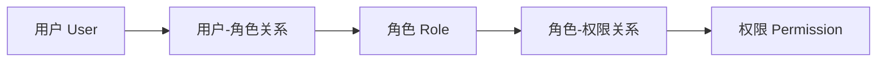
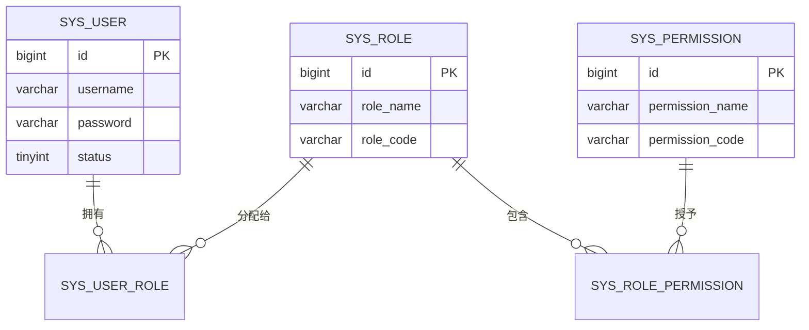
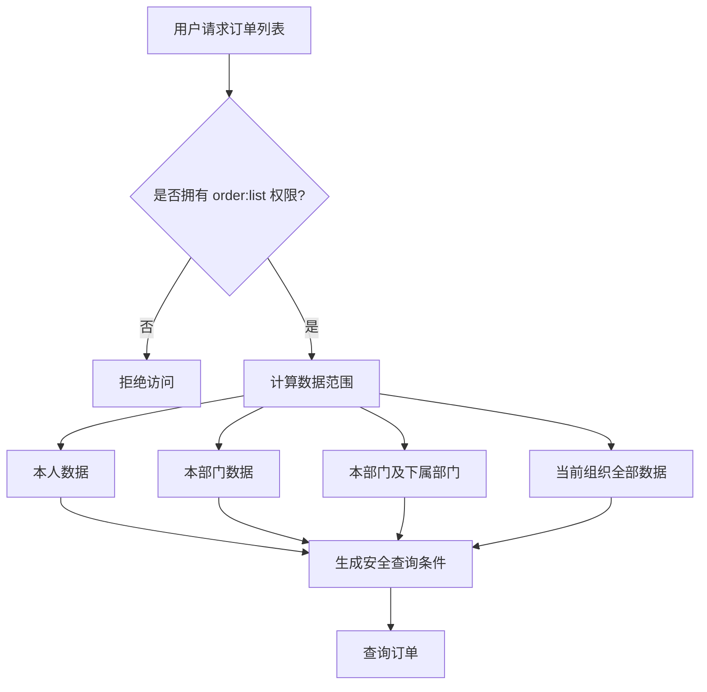
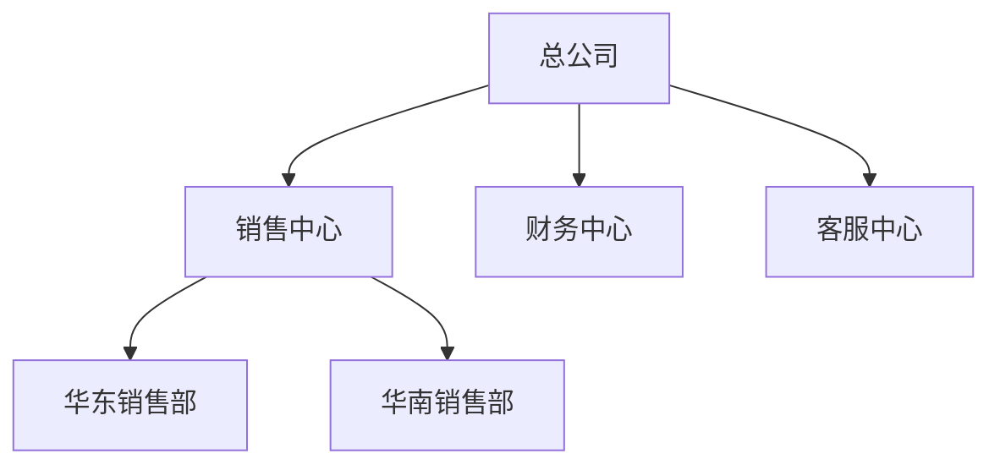
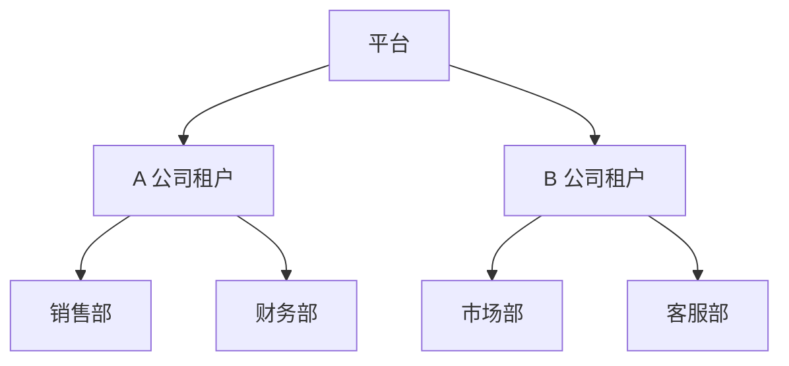
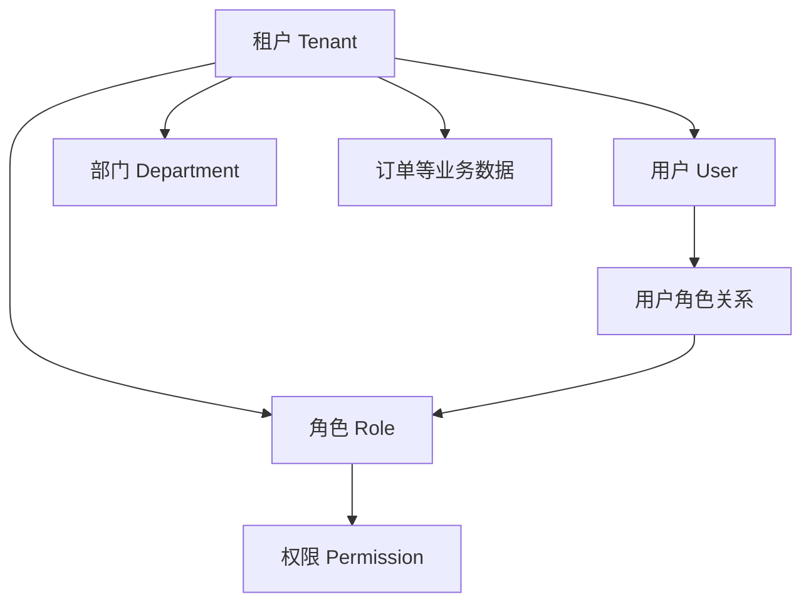
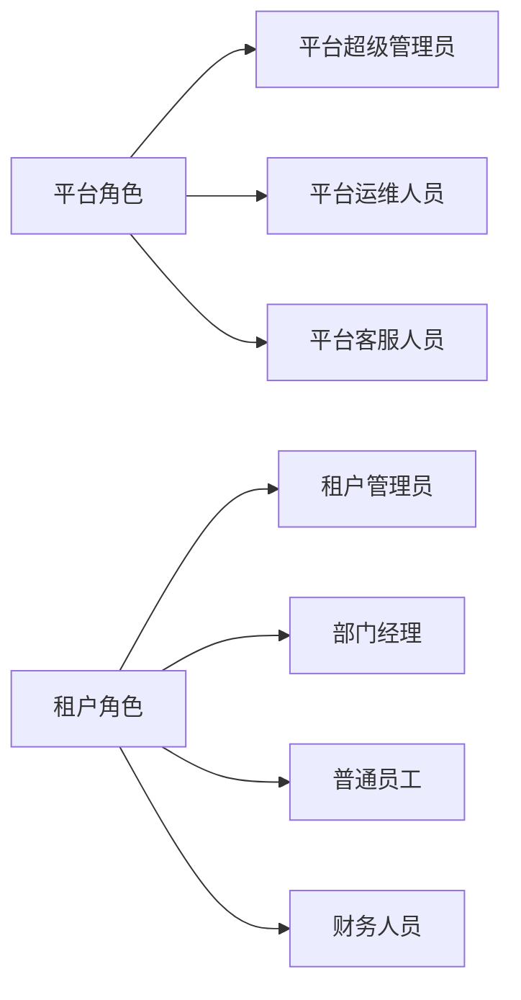
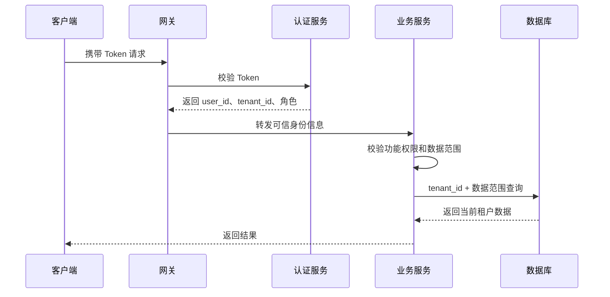
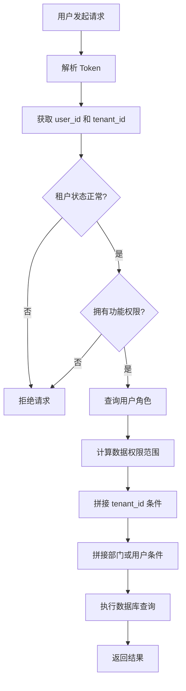
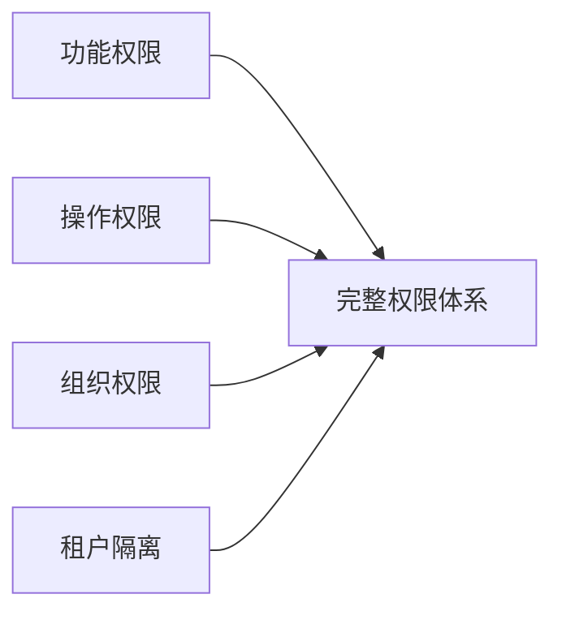

# RBAC 权限系统设计：从多部门到多租户

在企业管理系统中，权限控制很少只是简单的“用户能不能访问某个页面”。

系统初期可能只有一个公司、几个用户和几个角色。随着业务发展，系统通常会逐步引入部门、岗位、数据范围，最终还可能演进成多个企业共同使用的 SaaS 多租户系统。

权限模型也会随之演进：


本文以一个企业订单管理系统为例，介绍如何从基础 RBAC 模型开始，逐步设计出支持多部门和多租户的权限系统。

## 一、什么是 RBAC

RBAC，即基于角色的访问控制（Role-Based Access Control）。它的核心思想是：

> 不直接给用户分配权限，而是先给用户分配角色，再通过角色获得权限。

基本关系如下：



例如：

```text
张三 → 销售经理 → 订单查看、订单创建、订单审核
李四 → 销售员工 → 订单查看、订单创建
王五 → 财务人员 → 订单查看、收款确认
```

权限通常可以分为三类：

| 权限类型 | 解决的问题 | 示例 |
| --- | --- | --- |
| 菜单权限 | 用户能不能看到某个功能 | 是否显示“订单管理”菜单 |
| 操作权限 | 用户能不能执行某个动作 | 是否允许审核订单 |
| 数据权限 | 用户能访问哪些数据 | 只能查看本部门订单 |

菜单权限主要用于前端展示，操作权限和数据权限必须在后端进行校验。

## 二、基础 RBAC 模型

在只有一个组织的情况下，可以设计以下核心表：

```text
sys_user                用户表
sys_role                角色表
sys_permission          权限表
sys_user_role           用户与角色关系表
sys_role_permission     角色与权限关系表
```

表之间的关系可以表示为：



用户登录后，系统根据用户 ID 查询角色，再根据角色查询权限，最终得到当前用户的权限集合：

```json
[
  "order:list",
  "order:create",
  "order:update",
  "order:audit"
]
```

后端接口应该根据权限编码进行校验：

```java
@PreAuthorize("hasAuthority('order:audit')")
public void auditOrder(Long orderId) {
    // 审核订单
}
```

前端隐藏按钮只能改善用户体验，不能代替后端鉴权。即使前端没有显示“审核”按钮，用户仍然可能直接调用接口，因此后端必须再次校验。

## 三、从单组织扩展到多部门

当系统中出现销售部、财务部和客服部后，单纯判断“用户有没有订单查看权限”就不够了。

例如：

```text
销售员工：只能查看自己创建的订单
销售经理：可以查看销售部及下属部门的订单
财务人员：可以查看全公司的订单，但只能修改收款信息
客服人员：可以查看订单，但不能修改订单金额
```

此时需要把权限拆成两个维度：



功能权限解决“能不能访问”，数据权限解决“能访问哪些数据”。

## 四、部门树与数据范围

企业部门通常具有树形结构：



部门表可以设计为：

```text
sys_dept
----------------
id              部门 ID
parent_id       父部门 ID
dept_name       部门名称
dept_path       部门路径
status          部门状态
```

示例数据：

```text
id    parent_id    dept_name       dept_path
1     0            总公司          /1/
2     1            销售中心        /1/2/
3     2            华东销售部      /1/2/3/
4     2            华南销售部      /1/2/4/
```

角色可以配置以下数据范围：

```text
ALL       当前组织全部数据
DEPT      本部门数据
DEPT_SUB  本部门及下属部门数据
SELF      仅本人数据
CUSTOM    自定义部门数据
```

| 角色 | 数据范围 |
| --- | --- |
| 系统管理员 | 当前组织全部数据 |
| 销售经理 | 本部门及下属部门数据 |
| 销售员工 | 仅本人数据 |
| 财务人员 | 自定义部门数据 |

如果角色使用自定义部门范围，可以增加关系表：

```text
sys_role_dept
----------------
role_id
dept_id
```

业务数据也应该保存归属信息：

```text
orders
----------------
id
order_no
tenant_id
creator_id
dept_id
status
```

查询订单时，后端根据当前用户计算条件：

```sql
SELECT *
FROM orders
WHERE tenant_id = ?
  AND dept_id IN (?, ?, ?);
```

部门 ID 不能直接相信前端传入的参数，而应该由后端根据当前登录用户的角色和部门计算得到。

## 五、用户与部门的关系

最简单的设计是一个用户属于一个部门：

```text
sys_user
----------------
id
username
dept_id
```

但现实中，一个用户可能同时参与多个部门或项目：

```text
张三
├── 主部门：华东销售部
└── 协作部门：售前技术部
```

更灵活的方式是使用关联表：

```text
sys_user_dept
----------------
user_id
dept_id
is_primary
```

如果同一个用户在不同部门拥有不同角色，还可以继续细化：

```text
sys_user_dept_role
------------------
user_id
dept_id
role_id
```

例如：

```text
张三 → 华东销售部 → 销售经理
张三 → 售前技术部 → 技术顾问
```

## 六、订单系统案例

假设系统组织结构如下：

```text
公司
├── 销售部
├── 财务部
└── 客服部
```

系统中的用户和角色如下：

| 用户 | 部门 | 角色 |
| --- | --- | --- |
| 张三 | 销售部 | 销售员工 |
| 李四 | 销售部 | 销售经理 |
| 王五 | 财务部 | 财务人员 |
| 赵六 | 客服部 | 客服人员 |

权限规则：

```text
销售员工：查看本人订单、创建订单、修改本人订单
销售经理：查看销售部订单、创建订单、修改订单、审核订单
财务人员：查看订单、确认收款、查看财务报表
客服人员：查看订单、创建售后记录、查看售后记录
```

例如，张三查询订单时，最终可能生成：

```sql
SELECT *
FROM orders
WHERE tenant_id = 1001
  AND creator_id = 2001;
```

李四查询订单时，最终可能生成：

```sql
SELECT *
FROM orders
WHERE tenant_id = 1001
  AND dept_id IN (10, 11, 12);
```

虽然张三和李四都拥有 `order:list` 权限，但他们能看到的数据并不相同。

## 七、从多部门发展到多租户

当系统从内部管理系统变成 SaaS 平台后，可能会同时服务多家公司：



这时系统必须保证：

> A 公司的用户绝对不能访问 B 公司的数据。

多租户系统的核心对象可以表示为：



在共享数据库、共享表的设计中，所有租户相关表都应增加 `tenant_id`：

```text
sys_user
----------------
id
tenant_id
username
dept_id
```

```text
sys_role
----------------
id
tenant_id
role_name
role_type
data_scope
```

```text
orders
----------------
id
tenant_id
creator_id
dept_id
order_no
```

租户内的“全部数据”也只能是当前租户的全部数据，而不是平台中所有租户的数据。

## 八、平台角色与租户角色

多租户系统一般需要区分平台角色和租户角色：



平台角色主要负责：

```text
创建和禁用租户
管理平台套餐
查看租户运行状态
处理平台级配置
```

租户角色主要负责：

```text
管理本租户用户
管理本租户部门
分配本租户角色
管理本租户业务数据
```

角色表可以增加角色类型：

```text
role_type
----------------
PLATFORM    平台角色
TENANT      租户角色
```

平台管理员和租户管理员不能共用一套无边界的权限，否则容易出现租户管理员获得平台级权限的问题。

## 九、多租户数据隔离方案

### 1. 共享数据库、共享表

所有租户共用数据库和表，通过 `tenant_id` 区分数据：

```text
orders
--------------------------------
id       tenant_id       order_no
1        1001            A0001
2        1002            B0001
```

优点是成本低、开发和运维简单，适合大量中小租户。缺点是必须防止任何查询遗漏 `tenant_id` 条件。

### 2. 共享数据库、独立 Schema

不同租户使用不同 Schema：

```text
tenant_a.orders
tenant_b.orders
```

隔离性更好，但 Schema 数量较多时，数据库升级和维护会变得复杂。

### 3. 独立数据库

每个租户使用独立数据库：

```text
db_tenant_a
db_tenant_b
```

隔离性最高，适合大型客户或有较强合规要求的场景，但成本和运维复杂度也最高。

实际项目中可以采用混合方案：普通租户共享数据库，重点租户使用独立数据库。

## 十、请求中的租户身份

租户 ID 不能由前端随意传入：

```http
GET /orders?tenantId=1002
```

如果服务端直接相信这个参数，用户修改参数后就可能访问其他租户的数据。

较安全的流程如下：



Token 中可以包含：

```json
{
  "user_id": 10001,
  "tenant_id": 1001,
  "roles": ["sales_manager"]
}
```

服务端解析后，将租户信息放入当前请求上下文：

```java
TenantContext.setTenantId(token.getTenantId());
```

查询订单时自动加入：

```sql
SELECT *
FROM orders
WHERE tenant_id = 1001;
```

如果系统支持切换租户，则必须额外校验当前用户是否属于目标租户，以及是否拥有切换权限。

## 十一、完整的权限校验流程

一次订单查询请求的完整流程可以概括为：



最终的 SQL 可能是：

```sql
SELECT *
FROM orders
WHERE tenant_id = 1001
  AND dept_id IN (10, 11, 12)
  AND status != 'DELETED';
```

权限系统应该尽可能统一处理这些条件，避免每个业务接口都手动拼接，降低遗漏风险。

## 十二、推荐的数据模型

一个较完整的多租户 RBAC 系统可以包含以下表：

```text
sys_tenant              租户表
sys_user                用户表
sys_dept                部门表
sys_role                角色表
sys_permission          权限表
sys_user_role           用户与角色关系
sys_role_permission     角色与权限关系
sys_user_dept           用户与部门关系
sys_role_dept           角色数据范围
sys_tenant_package      租户功能套餐
```

核心业务表建议统一保留以下字段：

```text
tenant_id       数据所属租户
creator_id      数据创建人
dept_id         数据归属部门
created_at      创建时间
updated_at      更新时间
```

其中：

```text
tenant_id：解决租户隔离
dept_id：解决组织数据隔离
creator_id：解决本人数据范围
```

这三个字段可以支撑大部分企业管理系统的基础数据权限需求。

## 十三、常见问题

### 1. 只做菜单权限，不做数据权限

用户虽然不能访问无权限菜单，但可能通过接口直接获取其他部门的数据。

解决方案：在后端统一实现数据范围控制。

### 2. 依赖前端传递 `tenant_id`

前端参数可以被修改，不能作为租户隔离的依据。

解决方案：从 Token 或服务端会话中获取租户身份。

### 3. 平台管理员和租户管理员混用

角色边界不清晰，容易导致租户管理员获得平台级权限。

解决方案：明确区分平台角色和租户角色。

### 4. 删除部门后数据失去归属

订单、合同等历史数据可能无法确定原来的部门归属。

解决方案：部门采用逻辑删除，重要业务数据保留历史归属信息。

### 5. 权限缓存没有及时更新

角色权限修改后，用户可能在一段时间内仍然使用旧权限。

解决方案：修改权限时清理相关缓存，或者引入权限版本号机制。

## 十四、总结

RBAC 并不只是“用户、角色、权限”三张表。

当系统引入多部门后，需要考虑：

```text
用户能访问哪些功能？
用户能操作哪些数据？
用户能访问本部门还是下属部门？
```

当系统进一步发展为多租户后，还需要考虑：

```text
用户属于哪个租户？
租户之间如何隔离？
平台管理员和租户管理员如何区分？
租户切换是否合法？
```

因此，一个成熟的权限系统可以概括为：



权限系统可以按照以下顺序逐步演进：

```text
第一阶段：用户、角色、权限
第二阶段：增加部门和数据范围
第三阶段：增加多租户和 tenant_id
第四阶段：区分平台角色与租户角色
第五阶段：根据业务需要扩展字段权限、审批权限和临时授权
```

设计时最重要的原则是：

> 权限判断必须以后端为准，数据查询必须默认带上租户和数据范围条件。

只有将功能权限、数据权限、组织权限和租户隔离结合起来，RBAC 才能真正适用于复杂的企业级系统。
