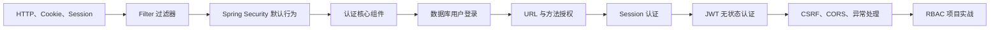
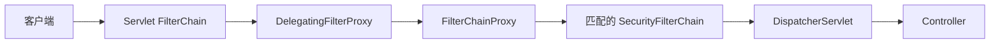
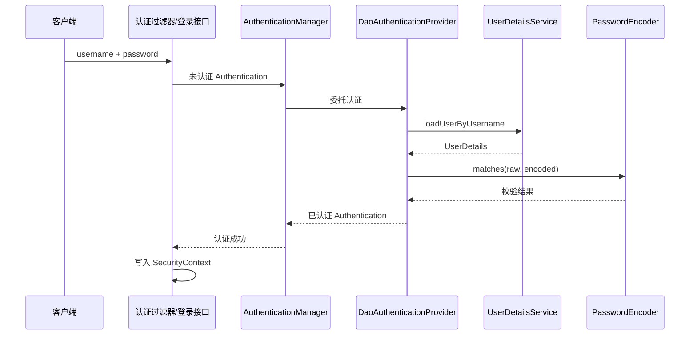
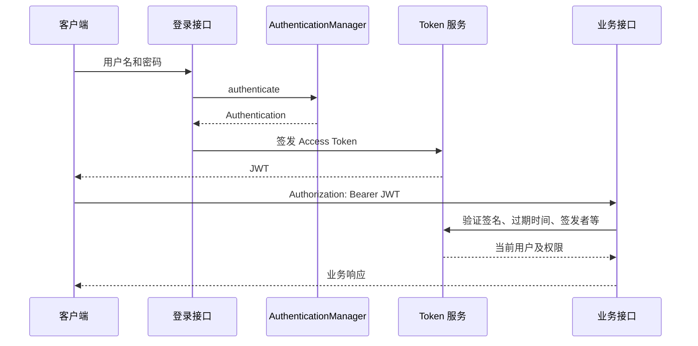
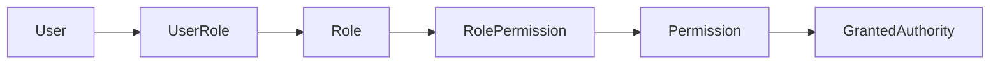

# Spring Security 从入门到实践

面对需要登录、鉴权、防攻击的后端接口，很多新手第一个反应就是：网上抄一个 JWT 过滤器。但如果不理解 Spring Security 为什么基于过滤器链工作，不理解认证和授权各自身边的组件，抄来的代码往往一改就崩，一出问题就无从排查。

Spring Security 是 Spring 生态中的安全框架，核心职责包括：

- **认证（Authentication）**：确认当前请求是谁发起的；
- **授权（Authorization）**：判断当前用户是否允许访问某个资源；
- **漏洞防护**：提供 CSRF、安全响应头、Session 固定攻击防护等能力；
- **安全上下文管理**：在一次请求中保存并传递当前用户身份。

本文以 Spring Security 6/7 的现代组件式配置思路展开，适合 Spring Boot 3/4 项目。不同小版本的 API 可能略有调整，应以项目实际依赖和官方文档为准。

## 学习目标

学完本文后，应当能够回答并实践下面这些问题：

1. 认证和授权有什么区别？
2. Spring Security 为什么基于过滤器链工作？
3. `Authentication`、`AuthenticationManager`、`AuthenticationProvider` 分别负责什么？
4. 用户名和密码是如何通过 `UserDetailsService`、`PasswordEncoder` 完成校验的？
5. `SecurityContext` 如何保存当前用户？
6. 如何配置 URL 权限和方法权限？
7. Session 登录和 JWT 登录有什么区别？
8. 401、403、CSRF、CORS 分别是什么问题？
9. 如何设计一个基于 RBAC 的前后端分离权限系统？
10. 如何测试和排查 Spring Security 配置？

## 推荐学习路线

不要一开始就照抄一个 JWT 过滤器。建议按以下顺序学习：



学习可以分成四个阶段：

| 阶段 | 重点 | 实践目标 |
| --- | --- | --- |
| 第一阶段 | 默认配置、过滤器链、表单登录 | 能看懂请求为什么被拦截 |
| 第二阶段 | UserDetailsService、PasswordEncoder、数据库用户 | 完成账号密码认证 |
| 第三阶段 | URL、角色、权限、方法鉴权 | 完成 RBAC 功能权限 |
| 第四阶段 | JWT、异常处理、CSRF、CORS、测试 | 完成前后端分离认证 |

## 认证与授权

| 概念 | 解决的问题 | 示例 |
| --- | --- | --- |
| 认证 | 你是谁？ | 校验用户名密码、Session、JWT |
| 授权 | 你能做什么？ | 判断是否具有 user:delete |

认证通常发生在授权之前：

```text
请求携带凭证
    ↓
认证成功，确定当前用户
    ↓
取得当前用户的角色和权限
    ↓
判断是否允许访问目标资源
```

### Spring Security 不等于 JWT

Spring Security 是安全框架，JWT 只是一种 Token 格式。Spring Security 可以使用：

- Session + Cookie；
- HTTP Basic；
- 表单登录；
- Bearer Token / JWT；
- OAuth 2.0；
- OpenID Connect；
- LDAP；
- 自定义认证方式。

因此正确的关系是：

```text
Spring Security
├── 认证和授权框架
└── 可以使用 JWT 作为一种认证凭证
```

## 先体验默认行为

添加依赖：

```xml
<dependency>
    <groupId>org.springframework.boot</groupId>
    <artifactId>spring-boot-starter-security</artifactId>
</dependency>

<dependency>
    <groupId>org.springframework.security</groupId>
    <artifactId>spring-security-test</artifactId>
    <scope>test</scope>
</dependency>
```

只要加入 starter，Spring Boot 就会自动保护 Web 接口。默认情况下通常会：

- 为请求启用认证；
- 创建一个开发用用户；
- 在控制台输出随机密码；
- 为浏览器请求提供默认登录页；
- 根据请求方式支持表单登录或 HTTP Basic。

这一步的学习重点不是修改配置，而是观察：

1. 不加依赖时接口为什么可以直接访问；
2. 加依赖后请求经过了哪些过滤器；
3. 登录成功后浏览器中出现了什么 Cookie；
4. 后续请求为什么不必再次输入密码。

## 核心架构：过滤器链

Spring MVC 的入口是 DispatcherServlet，但 Spring Security 的认证和请求级授权通常发生在 Controller 之前。



### 关键对象

**DelegatingFilterProxy**：Servlet 容器认识的是 Filter，而 Spring Bean 由 Spring 容器管理。DelegatingFilterProxy 用于把 Servlet 过滤器调用委托给 Spring 容器中的 Bean。

**FilterChainProxy**：Spring Security 的核心代理过滤器，内部管理一个或多个 SecurityFilterChain。

**SecurityFilterChain**：一条 SecurityFilterChain 包含：

- 这条链匹配哪些请求；
- 请求依次经过哪些安全过滤器；
- 认证、授权、CSRF、异常处理等配置。

项目中可以配置多条链，例如：

```text
/api/**       → JWT/Bearer Token 过滤器链
/actuator/**  → 运维接口过滤器链
其他请求      → 表单登录过滤器链
```

::: warning 多条过滤器链的顺序
一个请求只会进入第一条匹配的 SecurityFilterChain。配置多条链时必须关注 Order 和 securityMatcher，否则可能出现接口走错认证规则。
:::

### 为什么过滤器有顺序

认证必须早于授权。系统只有先建立当前用户的 Authentication，后面的授权过滤器才能判断用户是否有权限。典型顺序可以抽象为：

```text
加载 SecurityContext
    ↓
漏洞防护与请求头处理
    ↓
读取并校验认证凭证
    ↓
把 Authentication 放入 SecurityContext
    ↓
处理认证/授权异常
    ↓
检查请求是否有权访问
```

不要依赖记忆所有内置过滤器的顺序。需要插入自定义过滤器时，应明确它必须位于哪个已知过滤器之前或之后。

## 认证体系的核心组件

### Authentication

`Authentication` 既可以表示"等待认证的凭证"，也可以表示"认证成功后的用户身份"。主要信息包括：

| 属性            | 含义                      |
| ------------- | ----------------------- |
| principal     | 用户身份，认证后通常是 UserDetails |
| credentials   | 凭证，例如密码或 Token          |
| authorities   | 用户拥有的角色或权限              |
| authenticated | 是否已通过认证                 |
| details       | IP、Session ID 等附加信息     |

例如用户名密码登录开始时，可以创建一个尚未认证的 `UsernamePasswordAuthenticationToken`；认证成功后，Provider 返回包含用户信息和权限的已认证对象。

### SecurityContext 与 SecurityContextHolder

`SecurityContext` 保存当前 `Authentication`：

```java
Authentication authentication =
        SecurityContextHolder.getContext().getAuthentication();
```

在普通 Servlet 请求中，SecurityContextHolder 默认使用 ThreadLocal，使同一请求线程中的业务代码能够读取当前用户。请求完成后，Spring Security 会清理上下文，防止线程池复用导致身份串线。

业务代码还可以直接接收当前用户：

```java
@GetMapping("/me")
public UserInfo me(@AuthenticationPrincipal LoginUser user) {
    return user.toUserInfo();
}
```

::: warning 异步任务
ThreadLocal 不会自动传播到新线程。使用 @Async、线程池或 CompletableFuture 时，不应假设子线程天然拥有当前 SecurityContext。
:::

### AuthenticationManager

`AuthenticationManager` 是认证入口，核心方法接收一个 `Authentication` 并返回认证结果：

```java
Authentication authenticate(Authentication authentication);
```

常见实现 `ProviderManager` 会依次询问多个 `AuthenticationProvider`，找到支持当前 `Authentication` 类型的 Provider。

### AuthenticationProvider

`AuthenticationProvider` 执行具体认证逻辑。例如：

- DaoAuthenticationProvider：用户名密码认证；
- JWT/Bearer Token 对应的 Provider；
- LDAP Provider；
- OAuth 2.0 登录 Provider；
- 手机验证码、自定义工号等业务 Provider。

一个 Provider 主要完成两件事：

1. `supports`：判断是否支持当前 Authentication 类型；
2. `authenticate`：验证凭证并返回认证结果。

### UserDetailsService

`UserDetailsService` 根据用户名加载用户：

```java
public interface UserDetailsService {
    UserDetails loadUserByUsername(String username)
            throws UsernameNotFoundException;
}
```

它的职责是"查用户"，不是直接校验密码。密码比较通常由 DaoAuthenticationProvider 和 PasswordEncoder 完成。

### UserDetails

`UserDetails` 是 Spring Security 使用的用户视图，通常包含：

- 用户名；
- 密码摘要；
- GrantedAuthority 集合；
- 账号是否过期；
- 账号是否锁定；
- 凭证是否过期；
- 账号是否启用。

不建议让数据库实体直接承担所有安全职责。可以创建 `LoginUser` 适配业务用户实体：

```text
SysUser 数据库实体
    ↓ 转换
LoginUser implements UserDetails
    ↓
Spring Security 认证与授权
```

### PasswordEncoder

`PasswordEncoder` 负责：

- 注册时把原始密码编码成安全摘要；
- 登录时判断原始密码是否与摘要匹配。

```java
@Bean
PasswordEncoder passwordEncoder() {
    return PasswordEncoderFactories.createDelegatingPasswordEncoder();
}
```

`DelegatingPasswordEncoder` 生成的密码通常带算法前缀，例如：

```text
{bcrypt}$2a$10$...
```

如果项目数据库已经统一保存不带前缀的 BCrypt 摘要，也可以显式使用 `BCryptPasswordEncoder`，但新项目更适合使用可委托编码器，为以后升级算法留出空间。

::: danger 密码存储底线
不保存明文密码，不使用可逆加密保存密码，不使用单次 MD5/SHA 摘要，也不要在日志中输出密码或完整凭证。
:::

## 用户名密码认证流程

`DaoAuthenticationProvider` 是最常见的用户名密码认证 Provider。完整流程如下：



需要区分：

```text
UserDetailsService：根据用户名查询用户
PasswordEncoder：校验密码摘要
DaoAuthenticationProvider：组织用户名密码认证
AuthenticationManager：统一认证入口
SecurityContext：保存认证后的当前用户
```

## 第一套配置：Session + 表单登录

先掌握有状态登录，再学习 JWT。

```java
@Configuration
@EnableMethodSecurity
public class SecurityConfig {

    @Bean
    SecurityFilterChain securityFilterChain(HttpSecurity http)
            throws Exception {
        http
            .authorizeHttpRequests(auth -> auth
                .requestMatchers("/", "/css/**", "/error").permitAll()
                .requestMatchers("/admin/**").hasRole("ADMIN")
                .anyRequest().authenticated()
            )
            .formLogin(Customizer.withDefaults())
            .logout(Customizer.withDefaults());

        return http.build();
    }

    @Bean
    UserDetailsService users(PasswordEncoder encoder) {
        UserDetails user = User.withUsername("zhou")
            .password(encoder.encode("123456"))
            .roles("USER")
            .build();

        return new InMemoryUserDetailsManager(user);
    }

    @Bean
    PasswordEncoder passwordEncoder() {
        return PasswordEncoderFactories.createDelegatingPasswordEncoder();
    }
}
```

登录成功后，认证信息通常保存在服务端 Session 中，浏览器通过 Cookie 携带 Session ID。

```text
浏览器 Cookie：JSESSIONID=...
        ↓
服务端根据 Session ID 找到 SecurityContext
        ↓
恢复 Authentication
```

### Session 认证的优缺点

| 优点 | 缺点 |
| --- | --- |
| 服务端容易主动注销 | 集群需要共享 Session 或会话保持 |
| Cookie 由浏览器自动管理 | 浏览器场景需要正确处理 CSRF |
| Token 不暴露完整用户声明 | 前后端跨域配置相对复杂 |
| 适合传统服务端页面 | 微服务传递身份需要额外设计 |

## 连接数据库用户

### 推荐数据模型

学习阶段可以先采用：

```text
sys_user
sys_role
sys_user_role
sys_permission
sys_role_permission
```

这与经典的 RBAC 模型一致：

```text
User → Role → Permission
```

### 自定义 UserDetailsService

```java
@Service
public class DatabaseUserDetailsService
        implements UserDetailsService {

    private final UserMapper userMapper;
    private final PermissionMapper permissionMapper;

    public DatabaseUserDetailsService(
            UserMapper userMapper,
            PermissionMapper permissionMapper) {
        this.userMapper = userMapper;
        this.permissionMapper = permissionMapper;
    }

    @Override
    public UserDetails loadUserByUsername(String username) {
        SysUser user = userMapper.selectByUsername(username);
        if (user == null) {
            throw new UsernameNotFoundException("用户不存在");
        }

        List<GrantedAuthority> authorities =
                permissionMapper.selectCodesByUserId(user.getId())
                    .stream()
                    .map(SimpleGrantedAuthority::new)
                    .toList();

        return new LoginUser(user, authorities);
    }
}
```

这里需要加载的是系统授权真正使用的字符串，例如：

```text
ROLE_ADMIN
user:list
user:add
user:delete
```

不要在 `loadUserByUsername` 中自己拿明文密码做 equals 比较，交给 PasswordEncoder。

## 授权：URL、角色和权限

### 请求级授权

```java
http.authorizeHttpRequests(auth -> auth
    .requestMatchers("/auth/login", "/public/**").permitAll()
    .requestMatchers(HttpMethod.DELETE, "/users/**")
        .hasAuthority("user:delete")
    .requestMatchers("/admin/**").hasRole("ADMIN")
    .anyRequest().authenticated()
);
```

匹配规则按照声明顺序判断，所以应当把更具体的规则写在前面，把 `anyRequest` 放在最后。

### 方法级授权

Spring Boot 不会仅因加入 starter 就自动启用方法权限，需要显式配置：

```java
@Configuration
@EnableMethodSecurity
public class MethodSecurityConfig {
}
```

常见用法：

```java
@PreAuthorize("hasAuthority('user:delete')")
public void deleteUser(Long id) {
}

@PreAuthorize("hasRole('ADMIN')")
public void rebuildIndex() {
}

@PreAuthorize("#userId == authentication.principal.userId")
public UserProfile getProfile(Long userId) {
}
```

官方更推荐使用 `@PreAuthorize`，而不是旧的 `@Secured`。业务权限复杂时，可以把逻辑封装成 Bean：

```java
@PreAuthorize("@orderAuth.canEdit(authentication, #orderId)")
public void editOrder(Long orderId) {
}
```

### hasRole 与 hasAuthority

| 表达式 | 实际检查 |
| --- | --- |
| hasRole("ADMIN") | 默认检查 ROLE_ADMIN |
| hasAuthority("ROLE_ADMIN") | 直接检查 ROLE_ADMIN |
| hasAuthority("user:delete") | 直接检查 user:delete |

常见约定：

```text
角色：ROLE_ADMIN、ROLE_USER
细粒度权限：user:add、user:delete、order:export
```

不要一会儿把 ADMIN 存成角色，一会儿又存成普通权限，否则容易出现 `ROLE_` 前缀错误。

### 请求授权与方法授权如何选择

- URL 规则适合公共接口、登录接口、静态资源和大范围路由保护；
- 方法权限靠近业务服务，适合细粒度业务授权；
- 关键业务可以两层都保护，但需要避免规则彼此矛盾；
- 数据归属判断应在服务层或数据层再次执行，不能只靠 URL。

## 401 与 403 异常处理

| 状态 | 含义 | Spring Security 入口 |
| --- | --- | --- |
| 401 Unauthorized | 未认证、Token 无效或过期 | AuthenticationEntryPoint |
| 403 Forbidden | 已认证但权限不足 | AccessDeniedHandler |

前后端分离项目通常返回统一 JSON：

```java
@Bean
SecurityFilterChain securityFilterChain(HttpSecurity http)
        throws Exception {
    http.exceptionHandling(ex -> ex
        .authenticationEntryPoint((request, response, exception) -> {
            response.setStatus(HttpServletResponse.SC_UNAUTHORIZED);
            response.setContentType("application/json;charset=UTF-8");
            response.getWriter().write(
                    "{\"code\":401,\"message\":\"未认证或凭证已失效\"}");
        })
        .accessDeniedHandler((request, response, exception) -> {
            response.setStatus(HttpServletResponse.SC_FORBIDDEN);
            response.setContentType("application/json;charset=UTF-8");
            response.getWriter().write(
                    "{\"code\":403,\"message\":\"权限不足\"}");
        })
    );

    return http.build();
}
```

实际项目应复用统一 JSON 序列化工具，不建议手写 JSON 字符串。

::: note 为什么 ControllerAdvice 有时接不到异常
许多认证和请求授权异常发生在 DispatcherServlet 之前的过滤器链中，应由 AuthenticationEntryPoint 或 AccessDeniedHandler 处理，而不是只依赖全局 Controller 异常处理器。
:::

## JWT 无状态认证

### 基本流程



请求头通常为：

```http
Authorization: Bearer <JWT>
```

### 无状态配置

```java
@Bean
SecurityFilterChain apiSecurity(HttpSecurity http)
        throws Exception {
    http
        .sessionManagement(session -> session
            .sessionCreationPolicy(SessionCreationPolicy.STATELESS)
        )
        .authorizeHttpRequests(auth -> auth
            .requestMatchers("/auth/login", "/auth/refresh").permitAll()
            .anyRequest().authenticated()
        );

    return http.build();
}
```

`STATELESS` 表示 Spring Security 不依赖 HttpSession 保存和恢复登录认证状态。每次请求都必须携带并验证自己的凭证。

无状态**不代表**：

- 服务端永远不能查询数据库；
- 服务端不能使用 Redis；
- 服务端不保存 Refresh Token、黑名单或登录设备；
- 请求过程中不存在 SecurityContext。

认证成功后，当前请求仍然会创建 SecurityContext，只是不把它作为长期登录状态保存在 Session 中。

### 两种 JWT 接入方式

**方式一：OAuth2 Resource Server 支持**

对于标准 Bearer JWT，优先学习 Spring Security 自带的资源服务器支持：

```xml
<dependency>
    <groupId>org.springframework.boot</groupId>
    <artifactId>spring-boot-starter-oauth2-resource-server</artifactId>
</dependency>
```

```java
http.oauth2ResourceServer(oauth2 ->
    oauth2.jwt(Customizer.withDefaults())
);
```

再提供 `JwtDecoder` 或通过签发者、JWK Set 地址配置验证规则。框架会负责 Bearer Token 提取、JWT 验证、认证对象构建和标准错误处理。

这种方式更标准，适合：

- 对接独立认证中心；
- 使用 Spring Authorization Server；
- 使用 Keycloak、Auth0 等 OIDC/OAuth 2.0 服务；
- 服务只负责验证 Bearer JWT。

**方式二：自定义 OncePerRequestFilter**

学习项目也常见自定义 JWT 过滤器：

```text
读取 Authorization 请求头
    ↓
提取 Bearer Token
    ↓
验证签名、过期时间、issuer、audience
    ↓
加载或构造用户权限
    ↓
创建已认证 Authentication
    ↓
写入 SecurityContext
    ↓
继续过滤器链
```

然后插入到合适位置：

```java
http.addFilterBefore(
    jwtAuthenticationFilter,
    UsernamePasswordAuthenticationFilter.class
);
```

这种方式有助于理解底层流程，但生产项目必须认真处理异常、上下文清理、算法限制、密钥轮换和 Token 撤销，不能只复制几十行示例代码。

### JWT 必须校验什么

- 签名是否合法；
- 明确允许的签名算法；
- `exp` 是否过期；
- `nbf` 是否已经生效；
- `iss` 是否为可信签发者；
- `aud` 是否包含当前服务；
- 必要时校验 `jti`、Token 类型和用户状态。

JWT Payload 只是 Base64URL 编码，**不是加密**，不能存密码、身份证号等敏感信息。

### Access Token 与 Refresh Token

推荐的基本设计是：

| Token | 生命周期 | 作用 |
| --- | --- | --- |
| Access Token | 较短 | 调用业务接口 |
| Refresh Token | 较长 | 换取新的 Access Token |

安全重点：

- 两种 Token 应明确区分用途；
- Refresh Token 应支持服务端撤销；
- 刷新时可以轮换 Refresh Token；
- 检测旧 Refresh Token 被重复使用；
- 退出、改密、禁用账号后应考虑使相关 Token 失效。

## CSRF 与 CORS

### CSRF 是什么

CSRF 利用浏览器自动携带 Cookie 等凭证的行为，诱导用户在已登录状态下向目标网站发起非本人意愿的请求。

::: danger 不要看到前后端分离就直接关闭 CSRF
是否需要 CSRF 防护取决于凭证是否会被浏览器自动携带，而不是项目是否使用 Vue、React 或是否返回 JSON。
:::

一般判断：

| 凭证方式 | CSRF 风险 |
| --- | --- |
| Session Cookie | 通常需要 CSRF 防护 |
| JWT 存在 Cookie 并自动发送 | 仍然需要 CSRF 防护 |
| Bearer Token 由 JS 主动放入 Authorization Header | 通常可不使用传统 CSRF Token，但要重点防 XSS |

仅在确认 API 不依赖浏览器自动携带的认证凭证后，才考虑：

```java
http.csrf(csrf -> csrf.disable());
```

### CORS 是什么

CORS 是浏览器的跨源访问控制机制，解决"这个来源的前端能否调用后端"。

```java
http.cors(Customizer.withDefaults());
```

还需要提供 `CorsConfigurationSource`，明确允许：

- 哪些 Origin；
- 哪些 HTTP 方法；
- 哪些请求头；
- 是否允许携带凭证；
- 预检请求缓存时间。

不要在允许携带 Cookie 时同时使用任意 Origin。

### CSRF 与 CORS 的区别

```text
CORS：浏览器是否允许前端读取跨域响应
CSRF：浏览器自动携带凭证造成的伪造请求
```

CORS 配置正确不等于不存在 CSRF；Postman 不受浏览器 CORS 限制，也不代表接口认证有问题。

## 退出登录与 Token 失效

### Session 退出

Session 模式下，退出通常可以：

- 清理 SecurityContext；
- 使 HttpSession 失效；
- 删除相关 Cookie；
- 执行自定义 LogoutHandler。

### JWT 退出

纯自包含 JWT 在过期前通常仍可通过密码学验证。常见补救方案：

- Access Token 设置较短有效期；
- Redis 黑名单记录 `jti`；
- 用户表维护 `tokenVersion`；
- Refresh Token 服务端存储并撤销；
- 改密、封禁、退出所有设备时更新版本或撤销会话。

选择方案时需要在无状态程度、实时失效、安全性和 Redis 查询成本之间权衡。

## RBAC 权限设计

Spring Security 只规定如何表达和判断 GrantedAuthority，不替你决定业务权限表如何设计。一个常见 RBAC 模型是：



例如：

```text
张三
  ↓
销售经理
  ↓
order:list
order:edit
order:export
```

在 Spring Security 中，最终需要把这些权限转换为 `GrantedAuthority`：

```java
new SimpleGrantedAuthority("order:export")
```

然后使用：

```java
@PreAuthorize("hasAuthority('order:export')")
```

功能权限只回答"能不能导出"，数据权限还要继续回答"能导出哪些订单"。资源归属、部门范围、租户隔离等规则通常需要在服务层或查询层实现。

## 常见错误

### 使用废弃配置

旧教程常见 `WebSecurityConfigurerAdapter` 和 `EnableGlobalMethodSecurity`。现代项目应使用：

- SecurityFilterChain Bean；
- `@EnableMethodSecurity`；
- Lambda DSL。

### permitAll 与忽略过滤器链混淆

`permitAll` 表示请求仍经过 Spring Security，只是在授权阶段允许访问；完全忽略请求则不会应用安全响应头、SecurityContext 等安全能力。静态资源之外通常优先使用 `permitAll`。

### hasRole 的前缀错误

`hasRole("ADMIN")` 默认寻找 `ROLE_ADMIN`。如果数据库只保存 ADMIN 或把 `user:delete` 错当角色，会导致始终无权限。

### 认证成功但没有权限

常见原因：

- UserDetails 没有加载 authorities；
- 权限字符串拼写不一致；
- 方法权限没有启用；
- 注解方法不是 Spring Bean；
- 同类内部调用绕过了方法安全代理；
- URL 规则已经提前拒绝请求。

### JWT 解析成功就认为安全

Base64 解码 Payload 不等于验证 Token。必须验证签名以及标准声明，并限制可信算法和签发者。

### 在日志打印敏感信息

不要打印：

- 原始密码；
- Authorization 完整请求头；
- Access Token、Refresh Token；
- 密钥；
- 包含敏感声明的完整 JWT。

### 只保护页面按钮

前端隐藏按钮不构成安全边界。删除、导出、批量操作、详情接口都必须由后端校验权限和数据范围。

### 误把 401 和 403 当成同一种错误

- 没有有效身份：401；
- 已经登录但权限不足：403。

统一返回 200 再在响应体写失败码会降低网关、监控和客户端对 HTTP 语义的利用能力。

## 测试

### MockMvc 测试

```java
@SpringBootTest
@AutoConfigureMockMvc
class UserSecurityTests {

    @Autowired
    MockMvc mockMvc;

    @Test
    void anonymousCannotDeleteUser() throws Exception {
        mockMvc.perform(delete("/users/1"))
            .andExpect(status().isUnauthorized());
    }

    @Test
    @WithMockUser(authorities = "user:delete")
    void userWithAuthorityCanDeleteUser() throws Exception {
        mockMvc.perform(delete("/users/1")
                .with(csrf()))
            .andExpect(status().isOk());
    }

    @Test
    @WithMockUser(authorities = "user:list")
    void userWithoutAuthorityIsForbidden() throws Exception {
        mockMvc.perform(delete("/users/1")
                .with(csrf()))
            .andExpect(status().isForbidden());
    }
}
```

如果项目关闭了 CSRF，不需要在测试中添加 `with(csrf())`；如果启用了 CSRF，缺少 Token 可能先得到 403，从而掩盖你真正想测试的授权逻辑。

### 最低测试矩阵

| 场景 | 预期 |
| --- | --- |
| 匿名访问公开接口 | 允许 |
| 匿名访问受保护接口 | 401 |
| 登录用户访问普通接口 | 允许 |
| 无权限用户访问敏感接口 | 403 |
| 有权限用户访问敏感接口 | 允许 |
| 密码错误 | 认证失败 |
| 账号锁定或禁用 | 认证失败 |
| JWT 过期、签名错误、签发者错误 | 401 |
| 用户跨部门或跨租户访问数据 | 拒绝或无数据 |
| 登出、改密或封禁后的旧 Token | 符合项目失效策略 |

## 排错方法

### 开启调试日志

```yaml
logging:
  level:
    org.springframework.security: DEBUG
```

重点观察：

- 实际构建了哪些 SecurityFilterChain；
- 当前请求匹配哪条链；
- Authentication 是否创建成功；
- SecurityContext 中是否存在当前用户；
- authorities 到底是什么；
- 请求在哪个授权规则被拒绝。

生产环境不宜长期开启 TRACE，更不能让日志输出敏感凭证。

### 推荐排查顺序

```text
1. 请求是否进入预期的 SecurityFilterChain
2. 请求头或 Cookie 是否携带正确凭证
3. 认证过滤器是否成功创建 Authentication
4. Authentication 是否已认证
5. authorities 是否包含目标权限
6. URL 规则是否先拒绝
7. @EnableMethodSecurity 是否生效
8. 是否被 CSRF 或 CORS 问题干扰
9. 数据层是否还有资源归属限制
```

## 实战项目

建议做一个"用户与订单权限系统"，分四次迭代。

### 迭代一：内存用户

- 加入 Spring Security；
- 配置 SecurityFilterChain；
- 创建 USER 和 ADMIN；
- 实现公开接口、登录后接口、管理员接口；
- 观察 Session 和 SecurityContext。

### 迭代二：数据库 RBAC

- 建立用户、角色、权限和关联表；
- 实现 UserDetailsService；
- 使用 PasswordEncoder 注册和验证密码；
- 使用 hasAuthority 和 @PreAuthorize；
- 编写 401/403 测试。

### 迭代三：JWT 前后端分离

- 实现登录接口；
- 签发短期 Access Token；
- 设置 STATELESS；
- 验证 Bearer Token；
- 统一处理过期与无权限异常；
- 根据风险决定是否加入 Refresh Token。

### 迭代四：数据权限

- 销售只能查看自己的订单；
- 经理能查看本部门订单；
- 管理员能查看全部订单；
- 详情、修改、删除、导出采用相同数据范围；
- 增加跨用户、跨部门越权测试。

完成后应能画出完整链路：

```text
请求
  ↓
SecurityFilterChain
  ↓
认证过滤器
  ↓
AuthenticationManager
  ↓
AuthenticationProvider
  ↓
UserDetailsService + PasswordEncoder
  ↓
SecurityContext
  ↓
URL/方法授权
  ↓
Controller / Service
  ↓
数据权限
```

## 面试重点

### Spring Security 的认证流程

> 请求先进入 SecurityFilterChain。认证过滤器从请求中提取凭证并构造尚未认证的 Authentication，然后交给 AuthenticationManager。常见的 ProviderManager 会选择支持该凭证类型的 AuthenticationProvider。用户名密码场景下，DaoAuthenticationProvider 通过 UserDetailsService 查询用户，再使用 PasswordEncoder 比较密码。认证成功后返回包含用户及权限的 Authentication，并写入 SecurityContext，后续授权组件根据 authorities 判断请求能否访问资源。

### Spring Security 如何完成授权

> 用户认证成功后，其角色和权限会以 GrantedAuthority 的形式保存在 Authentication 中。Spring Security 可以通过 authorizeHttpRequests 进行请求级授权，也可以启用 EnableMethodSecurity 后用 PreAuthorize 进行方法级授权。角色通常带 ROLE_ 前缀，细粒度权限可以使用 user:delete 这样的编码。关键接口还要在服务端继续执行资源归属和数据范围校验。

### JWT 为什么叫无状态

> 无状态表示服务端不依赖为每个客户端保存的 HttpSession 来识别登录状态，每次请求都携带可验证的 Token。验证成功后，Spring Security 仍会为当前请求创建 SecurityContext，只是请求结束后不会把它作为长期登录状态保存到 Session。系统仍然可以使用数据库或 Redis 实现权限查询、黑名单和 Refresh Token 撤销。

### 401 和 403 的区别

> 401 表示请求没有有效认证身份，例如未登录、Token 过期或签名错误；403 表示用户已经认证成功，但缺少访问目标资源的权限。前者由 AuthenticationEntryPoint 处理，后者通常由 AccessDeniedHandler 处理。

### 为什么不能随意关闭 CSRF

> CSRF 是否需要防护取决于认证凭证是否由浏览器自动携带。Session Cookie 或 Cookie 中的 JWT 仍然可能受到 CSRF 攻击。只有确认 API 使用由客户端主动放入 Authorization 请求头的 Bearer Token，并且不依赖自动发送的认证 Cookie 时，才通常可以关闭传统 CSRF 防护，同时必须加强 XSS 防护。

## 总结

Spring Security 的主干可以浓缩为：

```text
SecurityFilterChain
    ↓
提取凭证并创建 Authentication
    ↓
AuthenticationManager
    ↓
AuthenticationProvider
    ↓
UserDetailsService + PasswordEncoder
    ↓
认证成功写入 SecurityContext
    ↓
请求级授权 + 方法级授权
    ↓
进入业务逻辑并继续校验数据权限
```

最重要的四句话：

```text
认证解决"我是谁"
授权解决"我能做什么"
数据权限解决"我能操作哪些数据"
Spring Security 的核心执行载体是过滤器链
```

## 参考资料

- [Spring Security：Servlet 架构](https://docs.spring.io/spring-security/reference/servlet/architecture.html)
- [Spring Security：认证架构](https://docs.spring.io/spring-security/reference/servlet/authentication/architecture.html)
- [Spring Security：DaoAuthenticationProvider](https://docs.spring.io/spring-security/reference/servlet/authentication/passwords/dao-authentication-provider.html)
- [Spring Security：PasswordEncoder](https://docs.spring.io/spring-security/reference/servlet/authentication/passwords/password-encoder.html)
- [Spring Security：方法级授权](https://docs.spring.io/spring-security/reference/servlet/authorization/method-security.html)
- [Spring Security：CSRF 防护](https://docs.spring.io/spring-security/reference/servlet/exploits/csrf.html)
